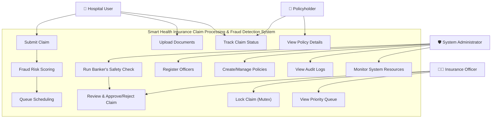
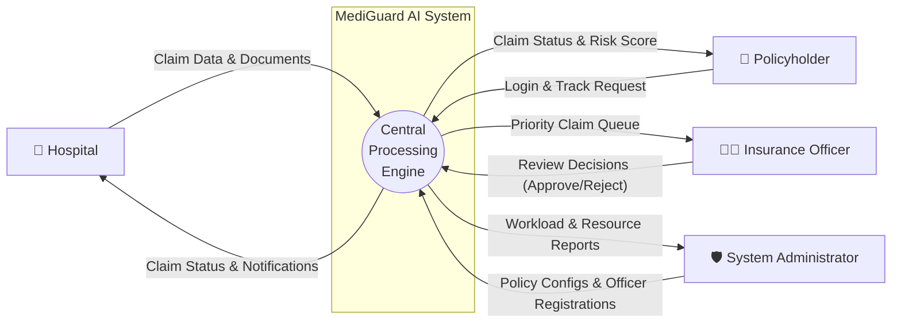
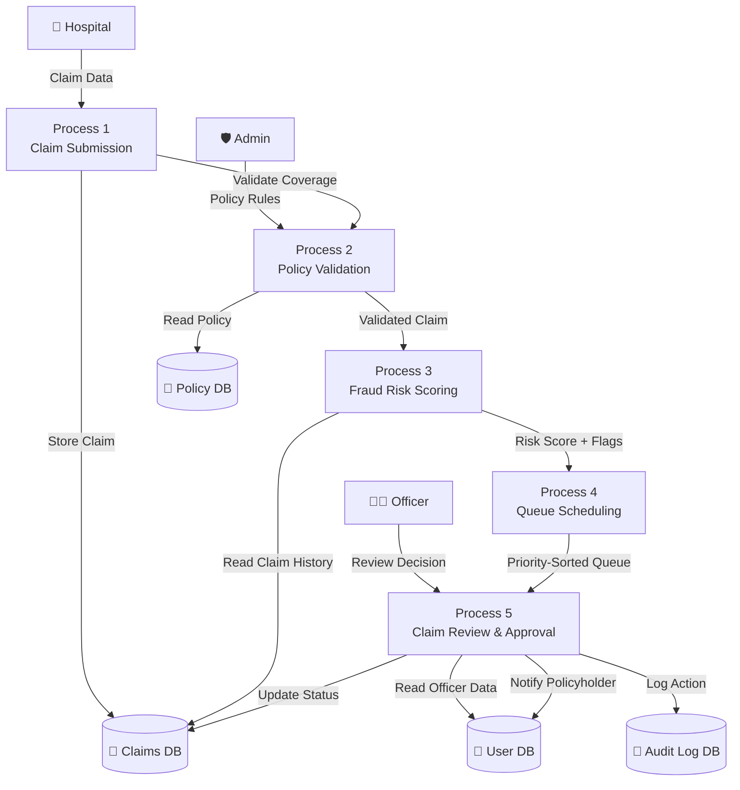
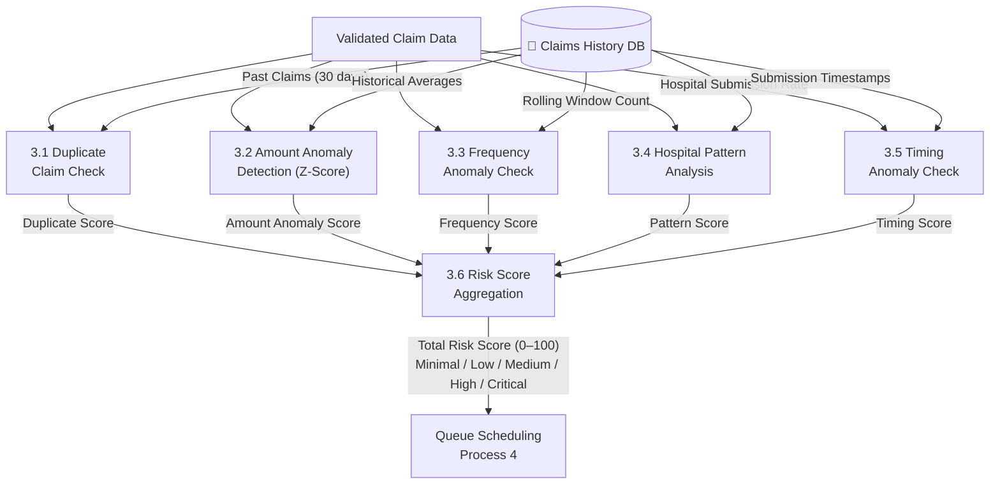
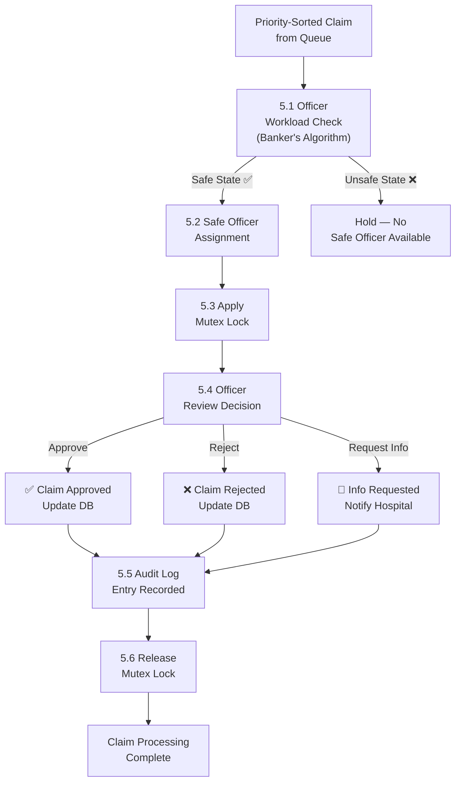
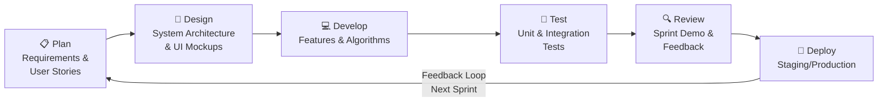

# COMPLEX COMPUTING PROBLEM (CCP)
# BS CYBER SECURITY

## Project Title
### MediGuard AI — Smart Health Insurance Claim Processing and Fraud Detection System

**Submitted To:** Umna Iftikar

**Submitted By:** HUSSAIN 68282

**Date of Submission:** 16 June 2026

**Course:** CYBER SECURITY — CCP

---

## Abstract

The health insurance sector faces significant operational challenges due to the manual and paper-based nature of traditional claim processing workflows. These challenges include processing delays, administrative overload, lack of transparency, and increasing incidents of fraudulent claims that cause substantial financial losses to insurance providers. This report presents the analysis and design of the Smart Health Insurance Claim Processing and Fraud Detection System — a centralized, web-based application developed as a Complex Computing Problem (CCP) for BS Cyber Security.

The proposed system automates the entire insurance claim lifecycle, from online claim submission by hospitals to policy validation, fraud risk assessment, officer review, and final approval or rejection. Five Operating System algorithms and security mechanisms — Multilevel Priority Queue, LRU Cache, Banker's Algorithm, Mutex Locks, and a Statistical Fraud Detection Engine — are integrated into the core processing logic to ensure efficient scheduling, deadlock prevention, memory optimization, race-condition prevention, and intelligent fraud identification.

Role-based dashboards are provided for Hospitals, Policyholders, Insurance Officers, and System Administrators. The system aims to reduce processing time, minimize fraudulent approvals, and deliver a transparent and user-friendly experience for all stakeholders.

---

## Letter of Acknowledgment

**June 16, 2026**

Umna Iftikar
Course Instructor — Cyber Security
Department of Computer Science

Dear Ma'am,

I would like to express my sincere and heartfelt gratitude to you for your unwavering guidance, continuous support, and invaluable feedback throughout the development of this Complex Computing Problem (CCP) project. Your expert advice and constructive criticism helped me understand the real-world application of cyber security principles and motivated me to strive for excellence.

This project — **MediGuard AI: Smart Health Insurance Claim Processing and Fraud Detection System** — would not have been possible without your encouragement and the knowledge you imparted during the course. The insights you shared on system design, requirements engineering, and process modeling greatly influenced the depth and quality of this work.

I am also grateful to our institution for providing us with the necessary resources and a conducive learning environment. I humbly acknowledge that any shortcomings in this report are entirely my own, and I remain open to your continued guidance.

Respectfully,
**HUSSAIN 68282**
BS Cyber Security

---

## Table of Contents

1. Problem Statement
2. Scope of the System
3. Features of the System
4. Functional and Non-Functional Requirements
5. Meta Data and Use Case Diagram
6. Data Flow Diagrams (DFDs)
7. Suggested Process Model
8. Prototype Screens Description
9. References / Bibliography

---

## 1. Problem Statement

A national health insurance provider processes a large volume of medical claims every month from hospitals across the country. The current claim handling process relies heavily on manual verification, which results in significant delays, increased administrative workload, and considerable difficulty in identifying fraudulent claims. There is no centralized system in place to verify policy coverage, confirm hospital eligibility, or detect abnormal claim patterns systematically.

These operational gaps lead to serious consequences including customer dissatisfaction, substantial financial losses due to fraudulent approvals, inconsistent decision-making, lack of audit trails, and overall operational inefficiencies.

The goal of this project is to analyze and design a centralized software system — **MediGuard AI** — that automates insurance claim processing and assists officers in identifying potentially fraudulent claims using rule-based statistical analysis and OS-inspired resource management algorithms.

### Key Problems Identified

- Manual claim submission leads to delays and human errors.
- No automated policy coverage verification is in place.
- Lack of a centralized fraud detection mechanism.
- Officers have no workload balancing or prioritized task queue.
- Policyholders cannot track the real-time status of their claims.
- No audit trail exists to log system activities for compliance.
- Simultaneous reviews of the same claim cause data inconsistencies (race conditions).

---

## 2. Scope of the System

### 2.1 Included in Scope

- Online submission of health insurance claims by registered hospital users.
- Validation of policy coverage limits, exclusion clauses, and claim eligibility rules.
- Automated fraud risk scoring using multi-factor statistical analysis (5 detection methods).
- Priority-based claim scheduling using a Multilevel Queue (4 queue levels).
- LRU Cache-based memory management to reduce database query latency by 60–80%.
- Banker's Algorithm-based workload distribution for safe officer assignment.
- Mutex Lock-based process synchronization to prevent simultaneous claim edits.
- Immutable audit trail logging every action (submission, lock, review, approval, rejection).
- Policyholder self-service portal for real-time claim tracking.
- Admin panel for user management, policy configuration, and system health monitoring.

### 2.2 Excluded from Scope

- Integration with international hospitals or cross-border insurance schemes.
- Advanced machine learning or deep learning model training for fraud detection.
- Real-time bank payment settlement or financial transaction processing.
- Mobile (iOS/Android) native application development.
- Integration with government health databases (e.g., NADRA, EHIF).

---

## 3. Features of the System

| Feature | Description |
|---|---|
| Online Claim Submission | Hospitals submit claims digitally with document uploads |
| Automated Claim Validation | Auto-verifies policy coverage and eligibility rules |
| Fraud Risk Scoring Engine | 5-method statistical analysis producing a 0–100 risk score |
| Role-Based Dashboards | Customized views for Hospital, Policyholder, Officer, Admin |
| Priority Queue Scheduling | 4-level multilevel queue (Emergency → Batch) |
| LRU Cache | Caches active policy metadata to reduce query latency |
| Banker's Algorithm | Deadlock-free officer workload assignment |
| Mutex Locks | Prevents race conditions during concurrent claim review |
| Audit Trail Logging | Immutable, timestamped log of every system action |
| Notifications & Alerts | Flags high-risk claims and alerts administrators |

---

## 4. Functional and Non-Functional Requirements

### 4.1 Functional Requirements

- **FR-01**: The system shall allow registered hospitals to submit insurance claims online.
- **FR-02**: The system shall allow hospitals to upload supporting documents.
- **FR-03**: The system shall automatically verify policy coverage limits and exclusion clauses.
- **FR-04**: The system shall validate claim eligibility based on predefined business rules.
- **FR-05**: The system shall compute a fraud risk score (0–100) using 5 statistical methods.
- **FR-06**: The system shall assign claims to priority queues based on urgency and fraud score.
- **FR-07**: The system shall allow insurance officers to approve, reject, or request more info.
- **FR-08**: The system shall apply a mutex lock to claims under active officer review.
- **FR-09**: The system shall use Banker's Algorithm to safely assign claims to officers.
- **FR-10**: The system shall allow policyholders to track the real-time status of their claims.
- **FR-11**: The system shall maintain an immutable audit trail log for every claim action.
- **FR-12**: The system shall allow administrators to register officers and create policies.
- **FR-13**: The system shall cache frequently accessed data using an LRU Cache with TTL support.

### 4.2 Non-Functional Requirements

| Category | Requirement |
|---|---|
| Performance | API endpoints shall respond within 200ms. LRU Cache reduces DB queries by ≥60%. |
| Security | Passwords hashed with bcrypt. JWT tokens expire after 7 days. Role-based authorization enforced. |
| Availability | System shall maintain ≥99% uptime. DB connections include retry logic. |
| Scalability | Architecture supports horizontal scaling. Queue and Banker's handle growing volumes. |
| Usability | Intuitive UI with color-coded status badges and fraud risk indicators. |
| Maintainability | Modular codebase with clear separation of models, routes, middleware, and algorithms. |
| Data Integrity | Mutex Locks prevent concurrent edits. DB operations use atomic transactions. |

---

## 5. Meta Data and Use Case Diagram

### 5.1 Meta Data

**Key Entities:**

- **User** — name, email, password (bcrypt), role (hospital/policyholder/officer/admin)
- **Claim** — claimId (UUID), hospitalId, policyholderId, treatmentType, claimAmount, fraudRiskScore (0–100), status (Pending/Under Review/Approved/Rejected), queueLevel (0–3), auditLog
- **Policy** — policyNumber, policyType, coverageAmount, usedAmount, coveredTreatments, deductible, coPayPercentage, lastAccessed (LRU eviction key)
- **AuditLog** — logId, claimId, userId, action, timestamp, ipAddress, previousState, newState
- **FraudAnalysis** — duplicateScore, amountAnomalyScore (z-score), frequencyScore, hospitalPatternScore, timingAnomalyScore, totalRiskScore, riskLevel
- **SystemResource** — officerId, maxCapacity (10), currentLoad, availableCapacity, safeStateFlag, allocationMatrix, needMatrix

### 5.2 Use Case Diagram

---

## 6. Data Flow Diagrams (DFDs)

### 6.1 Context Diagram — Level 0 DFD

### 6.2 Parent Diagram — Level 1 DFD

### 6.3 Child Diagrams — Level 2 DFDs

#### Process 3 — Fraud Detection Engine

#### Process 5 — Review Workflow

---

## 7. Suggested Process Model

### 7.1 Chosen Model: Agile (Iterative & Incremental)

The Agile software development model was selected for this project as it best supports evolving fraud detection thresholds, iterative OS algorithm integration, and continuous stakeholder feedback from hospital administrators and insurance officers.

### 7.2 Agile Sprint Process Diagram

### 7.3 Sprint Plan

| Sprint | Duration | Deliverables |
|---|---|---|
| Sprint 1 | 2 Weeks | Requirements, system design, DB schema, project structure setup |
| Sprint 2 | 2 Weeks | JWT authentication, role-based access control, User & Policy models |
| Sprint 3 | 2 Weeks | Claim submission, Policy Validation, Fraud Detection Engine, Priority Queue |
| Sprint 4 | 2 Weeks | LRU Cache, Banker's Algorithm, Mutex Lock integration, Officer workload dashboard |
| Sprint 5 | 2 Weeks | Full system testing, UI polish, audit trail, deployment, documentation |

---

## 8. Prototype Screens Description

The frontend is built with **React 19 + Vite**, styled with **Tailwind CSS v3** (dark mode, glassmorphic cards, neon accent colors, and smooth Framer Motion animations).

### 8.1 Top-Level Navigation Switcher
A tab-based navigation switcher ("Fraud Detection" | "OS Sandbox") at the top of the dashboard. Switching tabs uses animated sliding transitions powered by Framer Motion.

### 8.2 Fraud Detection Dashboard
Four KPI stat cards show: Total Claims, Fraud Blocked, Amount Saved ($2.4M), and Average Risk Score. Two Recharts visualizations display "Fraud Detection Trends" (Area Chart) and "Monthly Savings" (Bar Chart) alongside a "Recent Claims" audit timeline tracker.

### 8.3 Interactive Claim Wizard Form
A 4-step form wizard using animated stepper transitions:
1. **Patient Info** — Name, Age, Patient ID
2. **Treatment Details** — Treatment Type dropdown, Diagnosis Code, Frequency
3. **Provider Info** — Provider Name, Risk Slider (0–1), Duplicate History checkbox
4. **Financials** — Claim Amount ($), Distance from Home (miles)

### 8.4 Fraud Risk Assessment Card
A circular SVG gauge ring fills dynamically based on the risk score. It displays a percentage score in the center, a risk classification badge (Low/Medium/High/Critical), confidence percentage, and a detailed breakdown of each violation triggered.

### 8.5 Banker's Algorithm Simulator
An interactive table showing Allocation and Max matrices for P0–P4 processes with editable cells. The "Run Safety Check" button runs the safety algorithm and outputs a safe sequence (e.g., `P1 ➔ P3 ➔ P4 ➔ P0 ➔ P2`) along with step-by-step trace logs.

### 8.6 FIFO Queue Visualizer
An animated horizontal cell array with FRONT and REAR pointers. Enqueue adds elements sliding in from the right; Dequeue removes elements sliding out from the left. Queue Overflow and Underflow conditions are detected with alert messages.

### 8.7 LRU Cache Eviction Simulator
Four frame slots shown with hit/fault color-coded borders. A relative age stack displays LRU order. Metrics panel shows total hits, faults, total requests, and Hit Ratio (%).

---

## 9. References / Bibliography

- **[1]** Silberschatz, A., Galvin, P. B., & Gagne, G. (2018). *Operating System Concepts* (10th ed.). Wiley.
- **[2]** Sommerville, I. (2016). *Software Engineering* (10th ed.). Pearson.
- **[3]** Pressman, R. S., & Maxim, B. R. (2019). *Software Engineering: A Practitioner's Approach* (9th ed.). McGraw-Hill.
- **[4]** Cormen, T. H., Leiserson, C. E., Rivest, R. L., & Stein, C. (2009). *Introduction to Algorithms* (3rd ed.). MIT Press.
- **[5]** Knuth, D. E. (1997). *The Art of Computer Programming, Volume 1: Fundamental Algorithms* (3rd ed.). Addison-Wesley.
- **[6]** React (2026). *React – A JavaScript library for building user interfaces*. Retrieved from https://react.dev/
- **[7]** Vite (2026). *Next Generation Frontend Tooling*. Retrieved from https://vitejs.dev/
- **[8]** Recharts (2026). *Redefined chart library built with React and D3*. Retrieved from https://recharts.org/
- **[9]** Framer Motion (2026). *A production-ready motion library for React*. Retrieved from https://www.framer.com/motion/
- **[10]** Tailwind CSS (2026). *A utility-first CSS framework*. Retrieved from https://tailwindcss.com/
- **[11]** JWT.io (2026). *Introduction to JSON Web Tokens*. Retrieved from https://jwt.io/introduction/
- **[12]** OWASP Foundation (2023). *OWASP Top 10 Security Risks*. Retrieved from https://owasp.org/www-project-top-ten/
- **[13]** GitHub Actions (2026). *Automate your workflow from idea to production*. Retrieved from https://github.com/features/actions
- **[14]** Lucide React (2026). *Beautiful & consistent icon toolkit*. Retrieved from https://lucide.dev/
- **[15]** Vercel (2026). *Develop. Preview. Ship*. Retrieved from https://vercel.com/
